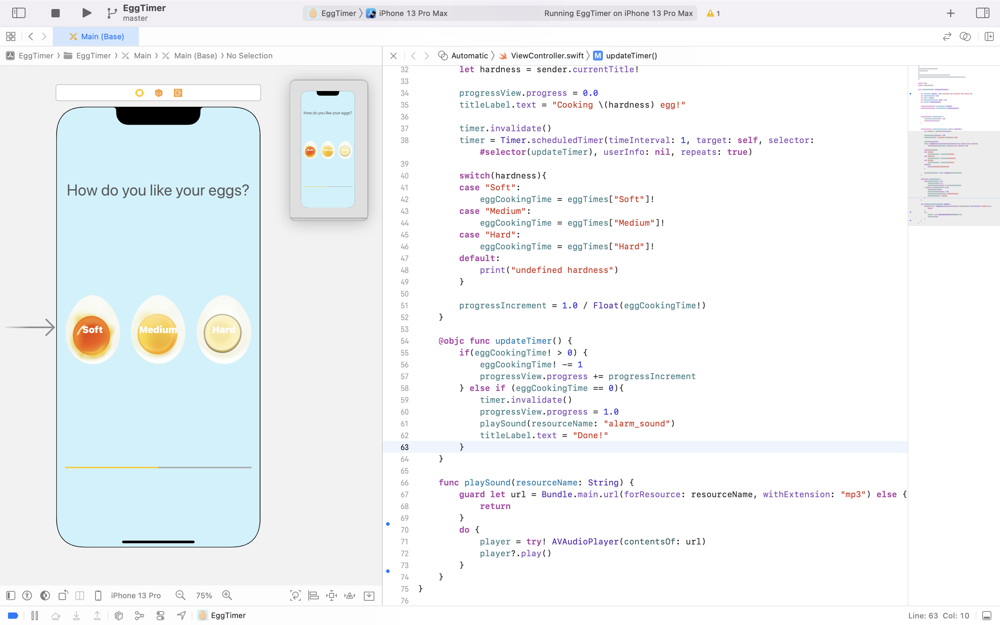

# Egg Timer

## Our Goal

This module will be a mix of tutorials and challenges. Most importantly, we want you to get comfortable with looking up how to do something you've never done before. In certain places of this module, you’ll need to follow the 5 step process you learnt in the Xylophone module and use Google search, StackOverflow and Apple Documentation to make your code do what you want it to. But there are also other parts where we’ll take you step-by-step through new Swift programming concepts. 

## What You'll Make

You’ll be building a beautiful egg timer app to boil your eggs to perfection depending on how you prefer your eggs. 

## What I learnt

* Swift Collection types - Dictionaries
* The Swift Timer API
* Conditional statements - IF/ELSE
* Conditional statements - Switch
* Functions with outputs
* How to use the ProgressView


## The Code
Most of the UI was already set from the template, and the only changes made was the ProgressView added to show users the 
progress of the cooking egg. When any of the Soft, Medium or Hard egg button is clicked this triggers the hardnessSelected() 
IBAction.

```swift
@IBAction func hardnessSelected(_ sender: UIButton) {
        let hardness = sender.currentTitle!
        
        progressView.progress = 0.0
        titleLabel.text = "Cooking \(hardness) egg!"
        
        timer.invalidate()
        timer = Timer.scheduledTimer(timeInterval: 1, target: self, selector: #selector(updateTimer), userInfo: nil, repeats: true)
        
        switch(hardness){
        case "Soft":
            eggCookingTime = eggTimes["Soft"]!
        case "Medium":
            eggCookingTime = eggTimes["Medium"]!
        case "Hard":
            eggCookingTime = eggTimes["Hard"]!
        default:
            print("undefined hardness")
        }
        
        progressIncrement = 1.0 / Float(eggCookingTime!)
}
```

From the code snippet, I added a Timer using the swift Timer API. The timer has a selector updateTimer() function that handles 
what happens when the timer counts down.

```swift
@objc func updateTimer() {
        if(eggCookingTime! > 0) {
            eggCookingTime! -= 1
            progressView.progress += progressIncrement
        } else if (eggCookingTime == 0){
            timer.invalidate()
            progressView.progress = 1.0
            playSound(resourceName: "alarm_sound")
            titleLabel.text = "Done!"
        }
}
```

As ealier said, a progessView was added to show the user the progress of the cooking egg and also, the title at the top of the
screen was updated when the egg starts to cook and when the egg is done cooking as the time elapsed. For more good UX, a sound
will be played when the time elapsed incase the user is away from their app phone and needs to know that the egg is done cooking.

```swift
func playSound(resourceName: String) {
        guard let url = Bundle.main.url(forResource: resourceName, withExtension: "mp3") else {
            return
        }
        do {
            player = try! AVAudioPlayer(contentsOf: url)
            player?.play()
        }
}
```

## The App




https://user-images.githubusercontent.com/34939672/222954697-ae49a201-cf4d-48f5-9d7e-6179e82fc0e5.mov

<br>
<br>


>This is a companion project to The App Brewery's Complete App Development Bootcamp, check out the full course at [www.appbrewery.co](https://www.appbrewery.co/)


